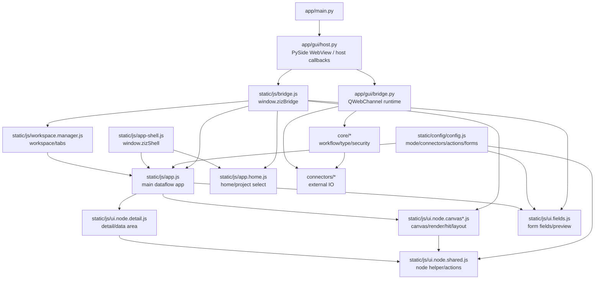
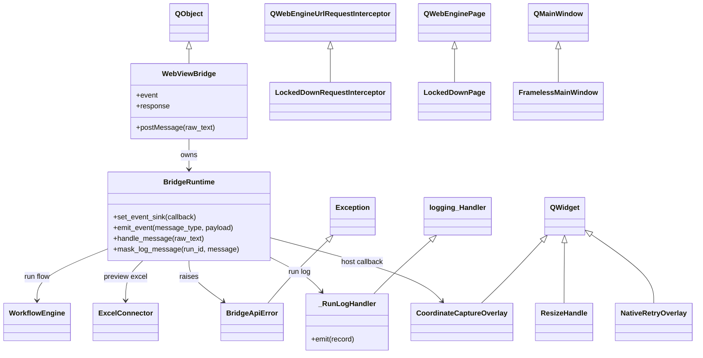
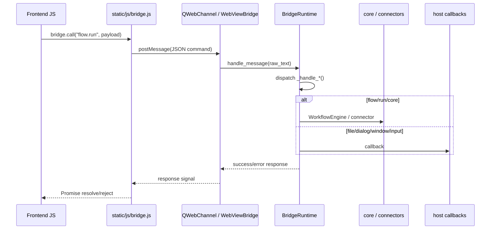
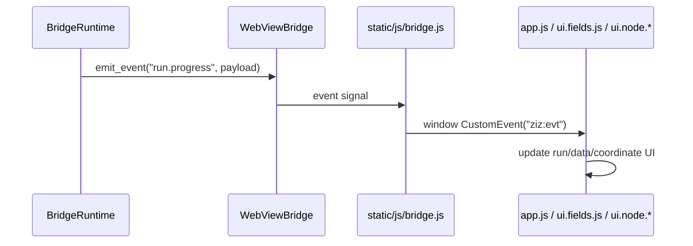
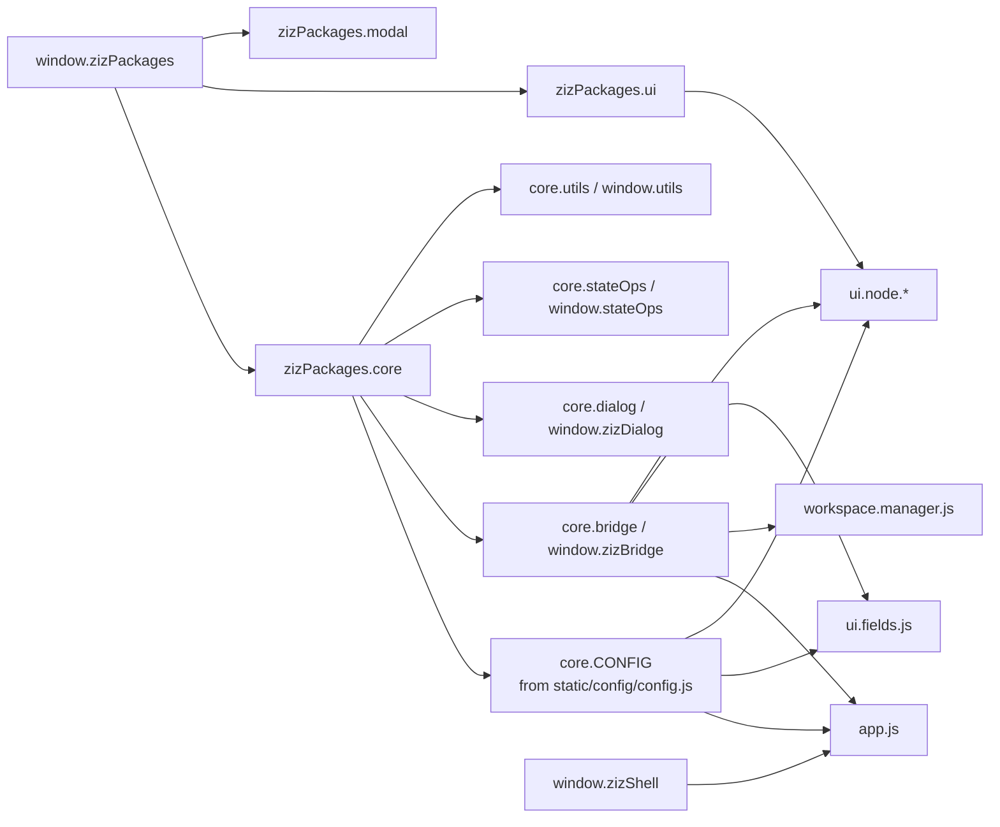

# 202607 Baseline / 棚卸しレポート

## 位置づけ

202607 版実装前の baseline を固定するための棚卸しレポート。

対象は 202607 改修に直結する `app/gui`、`app/main.py`、`static/js`、`static/config`、`tests/playwright/specs` に限定する。

## サマリ

| 項目 | 現状 |
| --- | --- |
| GUI backend 最大ファイル | `app/gui/bridge.py` 2254 行 |
| WebView host | `app/gui/host.py` 795 行 |
| フロント最大ファイル | `static/js/app.js` 3401 行 |
| config 正本扱い | `static/config/config.js` 529 行 |
| Playwright spec | 41 files |
| 主な旧境界 | QWebChannel、`window.zizBridge`、`window.zizShell`、`window.zizPackages`、`file://` |

## ファイル規模

### Python / config

| ファイル | 行数 | 現行責務 |
| --- | ---: | --- |
| `app/gui/bridge.py` | 2254 | QWebChannel command dispatch、flow/run/workspace/result/preview、hidden value、event |
| `app/gui/host.py` | 795 | PySide WebView、file scheme 制限、dialog、window control、coordinate capture |
| `static/config/config.js` | 529 | app mode、connector、action、form schema の混在 |
| `app/main.py` | 52 | CLI/GUI 起動分岐 |

### JavaScript 上位

| ファイル | 行数 | 現行責務 |
| --- | ---: | --- |
| `static/js/app.js` | 3401 | dataflow 画面、state 接続、run、workspace、layout、bridge 呼び出し |
| `static/js/ui.fields.js` | 2393 | form field、schema/preview 取得、file picker、auth、coordinate |
| `static/js/workspace.manager.js` | 2244 | workspace tree、tab、read/write/delete、flow open |
| `static/js/ui.node.canvas.js` | 1824 | canvas、drag、selection、sticky note、context menu |
| `static/js/state.js` | 1239 | state 操作、flow import/export 補助 |
| `static/js/ui.node.shared.js` | 1156 | node helper、connector/action UI、validation、node 操作 |
| `static/js/ui.node.detail.js` | 1098 | node detail、data area、schema/preview 表示 |

## ファイル構成図

## Python クラス図

## 参照 / 呼び出し図

### 現行 bridge command 経路

### event 経路

### JS global/package 依存図

## bridge command 呼び出し件数

| command | 件数 |
| --- | ---: |
| `workspace.setRoot` | 8 |
| `flow.load` | 8 |
| `workspace.readText` | 8 |
| `app.getStatus` | 5 |
| `result.getSchema` | 4 |
| `workspace.writeText` | 4 |
| `app.windowControl` | 3 |
| `workspace.getRoot` | 3 |
| `workspace.pickRoot` | 3 |
| `flow.save` | 3 |
| `result.getPreview` | 2 |
| `flow.list` | 2 |
| `workspace.delete` | 2 |
| その他 11 command | 1 ずつ |

## 主要な分離候補

| 現行 | 分離先 |
| --- | --- |
| `app/gui/bridge.py` command dispatch | `app/server/routes/*` |
| `app/gui/bridge.py` workspace 処理 | `workspace_service` |
| `app/gui/bridge.py` run/result 処理 | `run_service` / `result_service` |
| `app/gui/bridge.py` hidden value | `hidden_value_service` |
| `app/gui/host.py` dialog/window/coordinate | `host_dialogs.py` / `host_window.py` / `host_coordinate.py` |
| `static/config/config.js` | `config/catalog/*` + `/api/catalog/*` |
| `static/js/app-shell.js` | `AppShell` library |
| `static/js/ui.node.*` | `WorkflowDesigner` library + app adapter |
| `static/js/bridge.js` | localhost API client |

## baseline 判断

- 最初に削るべきは `static/config/config.js` の直接参照。
- 次に `window.zizBridge` / QWebChannel 直結を localhost API client へ置き換える。
- `AppShell` と `WorkflowDesigner` は現行名に引きずられず、public API 文書を正本にする。
- `run/result/events` は影響が大きいため、catalog/workspace/flow の後に移行する。
- Playwright spec は 41 files あるため、既知失敗と新規回帰を分けてから実装に入る。

## 次アクション

1. Playwright 全面 baseline は `deferred-tasks-draft.md` に後回しとして記録する。
2. `static/config/config.js` の参照箇所を `catalog-config-migration-breakdown.md` に分解済み。
3. `bridge.py` の handler を `bridge-route-service-breakdown.md` に API route/service 単位で分解済み。
